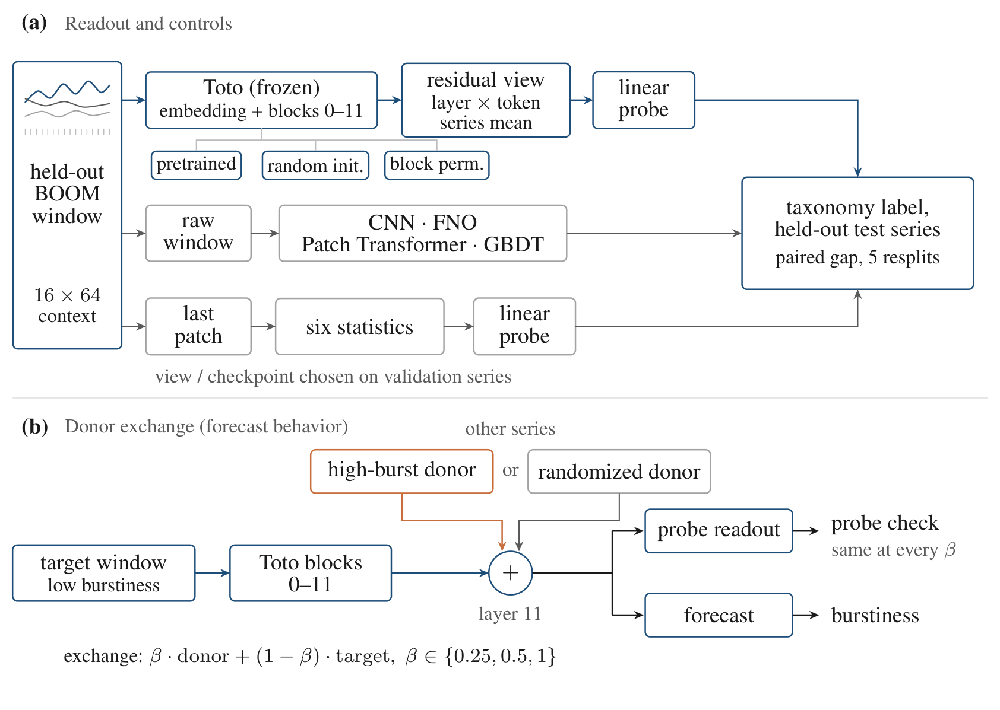
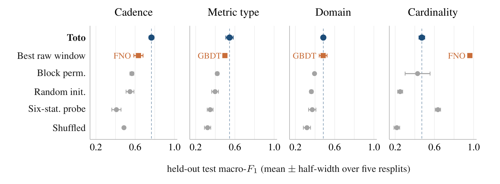

# What Does an Observability Foundation Model Know?

Code and audited results for the paper "What Does an Observability Foundation Model Know?", **NeurIPS 2026 (Poster)**.

<p align="center">
  <a href="https://arxiv.org/abs/2610.05577">Paper (arXiv)</a>
</p>



## Contents

- [What's in this repo](#whats-in-this-repo)
- [Installation](#installation)
- [Check the paper's numbers (CPU)](#check-the-papers-numbers-cpu)
- [Rerun the pipeline (GPU cluster)](#rerun-the-pipeline-gpu-cluster)
- [Paper → code → results](#paper--code--results)
- [Results](#results)
- [Citation](#citation)
- [License](#license)

## What's in this repo

- **Audited results** (`results/`): the result tables behind every number in the paper, for all five resplits. `results/E2E_AUDIT.json` records each file's seeds, row counts and SHA-256 hash.
- **A CPU verifier** (`reproduce/`): recomputes 424 reported values from `results/` and checks them against the paper.
- **Figure data**: scripts that rebuild the values plotted in Figures 1, 3 and 4.
- **The full pipeline** (`scripts/`, `examples/slurm/`): every stage from activation dumps to the summary tables, with Slurm launchers.

<details>
<summary><b>Repository layout</b></summary>

```
.
├── toto_interp/                    # analysis library: probes, labels, baselines, interventions, transfer
├── scripts/                        # pipeline stages, summarizers, audit, figure data, data staging
├── examples/slurm/                 # Slurm launchers for the GPU-cluster rerun
├── results/
│   ├── toto_taxonomy/              # Toto probes and baselines (Tables 1, 2, 4, 5, 10)
│   ├── moment_exchange_transfer/   # MOMENT, donor exchange, transfer (Tables 3, 6–9)
│   └── E2E_AUDIT.json              # seeds, row counts and SHA-256 per result file
├── reproduce/                      # verify_paper_numbers.py, expected_numbers.csv, verify_against.sh
├── tests/                          # unit tests
├── docs/                           # LSTF dataset setup, recorded asset revisions
├── assets/                         # README figures
├── THIRD_PARTY_NOTICES.md          # attribution for material adapted from Datadog Toto
├── licenses/                       # Apache-2.0 text and Datadog Toto NOTICE
└── requirements.txt, pyproject.toml
```
</details>

## Installation

```bash
git clone --branch neurips-2026-v1 https://github.com/DhyeyMavani2003/toto-interp.git
cd toto-interp
```

**To check the paper's numbers**, you need four packages:

```bash
python -m venv .venv
source .venv/bin/activate
pip install numpy pandas scipy matplotlib
```

**To rerun the pipeline**, build a Python 3.12 environment on your cluster. Install the `torch` build that matches your cluster's CUDA version first, then:

```bash
python3.12 -m venv .venv-gpu
source .venv-gpu/bin/activate
pip install -r requirements.txt
pip install -e .
pip install --no-deps momentfm==0.1.4   # its own dependency pins conflict with requirements.txt
```

The launchers expect this environment at `.venv-gpu` in the repository root. The unit tests also run in it: `python -m pytest -q tests`.

## Check the paper's numbers (CPU)

```bash
python reproduce/verify_paper_numbers.py
```

This recomputes 424 values from `results/` and compares each with `reproduce/expected_numbers.csv`. The run should end with:

```
PASS 424  FAIL 0  TOTAL 424
ALL PAPER NUMBERS VERIFIED
```

The checks cover Tables 1–10, the values plotted in Figures 1, 3 and 4, the means, half-widths and win counts quoted in the text, and the appendix series and window counts. They also include a 48-cell win-count summary and 11 derived margins.

To rebuild the figure data, run the two figure scripts in this order:

```bash
python scripts/plot_camera_ready_figures.py
python scripts/make_camera_ready_fig_data.py
```

They write to `paper/neurips2026/figures/`:

- `data/*.csv`: the plotted values.
- `tikz/gen/`: the TikZ coordinates for Figures 1, 3 and 4.
- `cr_figure_values.csv`: every plotted value with the file and columns it came from.
- Matplotlib previews of the same values.

Both scripts check their values against the numbers printed in the paper and stop if any differ.

## Rerun the pipeline (GPU cluster)

A full rerun regenerates `results/` from scratch for seeds 42–46. It downloads the data and model weights, extracts activations on GPUs, and fits probes on CPUs. Each launcher in `examples/slurm/` is a Slurm array over the five seeds.

### 1. Stage data and models

Run these on a login node with network access. Log in to Hugging Face first (`huggingface-cli login`, or set `HF_TOKEN`). Staging fetches about 2,700 BOOM series folders, and unauthenticated downloads hit rate limits.

```bash
export HF_HOME="$PWD/.cache/huggingface"
python scripts/stage_assets.py --snapshot-path data/boom_snapshot --seeds 42 43 44 45 46 --max-series-per-split 500
python scripts/stage_fev_safe_datasets.py
python scripts/download_lsf_datasets.py --output-dir data/lsf_datasets
python -c "from toto_interp.moment_loader import load_moment_with_fallback; load_moment_with_fallback()"  # caches MOMENT-1-base
```

The launchers read the Hugging Face cache under the repository root.

| Asset | Source | Used for |
|---|---|---|
| BOOM (2,807 series) | Hugging Face [`Datadog/BOOM`](https://huggingface.co/datasets/Datadog/BOOM) | All probes, baselines and exchanges |
| Toto-Open-Base-1.0 | Hugging Face [`Datadog/Toto-Open-Base-1.0`](https://huggingface.co/Datadog/Toto-Open-Base-1.0) | The model under study |
| MOMENT-1-base | Hugging Face [`AutonLab/MOMENT-1-base`](https://huggingface.co/AutonLab/MOMENT-1-base), via `momentfm` | Cross-model comparison |
| FEV (11 configurations) | Hugging Face [`autogluon/fev_datasets`](https://huggingface.co/datasets/autogluon/fev_datasets) | Zero-shot transfer |
| LSTF (ETTh1, ETTh2, weather, electricity) | Time-Series-Library bundles on Google Drive ([setup](docs/lsf_setup.md)) | Zero-shot transfer |

Each dataset and checkpoint is used under its own terms. The Rohlik FEV configurations come from Rohlik's Kaggle competition, whose rules set their terms. This repository stores only aggregate transfer metrics for them. [docs/asset_provenance.md](docs/asset_provenance.md) records the exact Hugging Face revisions the rerun resolved.

### 2. Run the stages

From the repository root, export `REPO` (the absolute path of this checkout) and `SOFTWARE_STACK` (the environment module that provides Python), and create the log directory with `mkdir -p logs`. Then submit each launcher with your site's account and partition:

```bash
sbatch --account=<account> --partition=<partition> examples/slurm/run_taxonomy_suite.sh
```

GPU launchers request one NVIDIA A10 (`--gres=gpu:A10:1`). Override this if your cluster has different GPUs. Later stages read the outputs of earlier ones, so submit them in order or chain them with Slurm dependencies (the launcher headers show how). `RUNS_ROOT` changes where a stage writes its outputs.

The last column shows the time and peak memory each launcher used in the reported runs (per seed). "—" means it wasn't recorded; the launcher's memory request is the guide there. When a stage has several launchers, run them top to bottom; each line in the last columns belongs to the launcher on the same line.

| # | Stage | Launcher(s) | Runs on | Paper items | Time / peak memory |
|---|---|---|---|---|---|
| 1 | Toto activations (pretrained, random-init),<br>Cramér's V, raw-window models | `run_taxonomy_suite.sh` | GPU | Tables 1, 4, 10; Figs. 1, 3; §5.2 | — (requests 32 GB) |
| 2 | Linear probes on Toto activations | `run_taxonomy_probes.sh` | CPU (16 cores) | Tables 1, 10; Figs. 1, 3 | 1 h 07 – 1 h 25 / 18.7–21.3 GB |
| 3 | Held-out-combination tests,<br>common-support probes | `run_holdout_grid.sh` | CPU (2 cores) | Tables 2, 5 | 11–21 min / up to 8.8 GB |
| 4 | Block-permuted Toto activations,<br>then probes | `run_layer_permuted_pretrained_a10.sh`<br>`run_layer_permuted_pretrained_probe_followup.sh` | GPU<br>CPU | Tables 1, 10 | ~7 min / 42–49 GB<br>39 min – 1 h 19 / ~79 GB |
| 5 | MOMENT activations (pretrained, random-init),<br>then probes | `run_moment.sh`<br>`run_moment_random.sh`<br>`run_moment_dynamic.sh`<br>`run_moment_random_probe_followup.sh` | GPU<br>GPU<br>CPU<br>CPU | Tables 3, 8 | 21–37 min / ~29 GB<br>48–53 min / 29–31 GB<br>—<br>— / ~91 GB |
| 6 | Toto donor exchange | `run_toto_donor_exchange.sh` | GPU | Table 6; Fig. 4 (left) | 3–4 min / 6.7–9.0 GB |
| 7 | MOMENT matched interchange | `run_moment_interchange.sh` | GPU | Table 9; Fig. 4 (right) | 1–2 min / 1.7–3.0 GB |
| 8 | Toto dynamic probes,<br>then zero-shot transfer | `run_toto_dynamic.sh`<br>`run_transfer.sh` | CPU<br>GPU | Table 7 | —<br>~1 min / 1.4–1.8 GB |

<details>
<summary><b>Main settings of each stage</b></summary>

1. `run_taxonomy_suite.py --seed SEED --raw-only` runs `dump_toto_activations.py --context-length 1024 --max-series-per-split 500 --max-windows-per-series 4` for pretrained and random-init Toto, then `compute_structural_confounding.py`, then the FNO, CNN, Transformer and GBDT raw-window models (`fit_toto_probes.py`; width 32, 3 layers, 16 modes, 20 epochs, batch 16).
2. `run_taxonomy_probes.py --seed SEED --skip-post-controls --reuse-existing` fits the taxonomy linear probes on pretrained and random-init activations.
3. `run_holdout_grid.py --source {pretrained,random_init} --seed SEED --rotation SEED-42` runs the held-out-combination tests (`run_structural_holdout_probes.py`) and the common-support probes (`run_conditional_probes.py`).
4. `dump_toto_activations.py --layer-permutation-seed SEED --weight-source layer_permuted_pretrained`, with both pooling modes, then probe fits. Default output: `runs/layer_permuted_pretrained`.
5. `dump_moment_activations.py --seed SEED --seq-len 512 --max-series-per-split 500 --max-windows-per-series 4 --layers 3 6 9 11 --token-positions all_context --pooling-modes series_mean` for pretrained and random-init MOMENT, then taxonomy and dynamic probe fits. `enrich_moment_run_provenance.py` runs inside `run_moment_random_probe_followup.sh` (random-init) and `run_moment_interchange.sh` (pretrained). `enrich_moment_random_provenance.sh` reruns only the random-init enrichment. Default output: `runs/moment_suite`.
6. Fits the layer-11, all-context, series-mean future-burstiness probe, then runs `run_toto_paired_patch.py --split test --split-seed SEED --seeds SEED --context-length 1024 --max-series 500 --max-windows-per-series 4 --max-windows-eval 2000 --num-pairs 40 --num-samples 16 --blend {0.25,0.5,1.0}`. Default output: `runs/toto_exchange_transfer`.
7. `run_moment_paired_interchange.py --split-seed SEED --sampling-seed SEED --num-pairs 40 --blends 0.25 0.5 1.0 --high-quantile 0.75 --low-quantile 0.25 --null-match-k 5 --secondary-endpoint auto`.
8. `run_toto_dynamic.sh` fits the Toto dynamic probes that transfer applies. `run_transfer.sh` then runs `run_toto_transfer.py --dataset both --fev-safe-only --max-series 100 --max-windows-per-series 4 --lsf-datasets ETTh1 ETTh2 weather electricity --context-length 1024 --validation-select-one-per-label --require-eval-provenance`.

</details>

### 3. Summarize, audit and verify

Run these on a CPU or login node. The paths below are the launchers' default output directories.

```bash
python scripts/summarize_taxonomy_suite.py \
  --runs-root runs/taxonomy_suite \
  --layer-permuted-runs-root runs/layer_permuted_pretrained \
  --output-dir runs/summary/toto_taxonomy
python scripts/summarize_moment_exchange_transfer.py \
  --runs-root runs/toto_exchange_transfer \
  --moment-runs-root runs/moment_suite \
  --output-dir runs/summary/moment_exchange_transfer \
  --seeds 42 43 44 45 46
python scripts/audit_results.py \
  --moment-exchange-transfer-summary-dir runs/summary/moment_exchange_transfer \
  --taxonomy-summary-dir runs/summary/toto_taxonomy \
  --output runs/summary/E2E_AUDIT.json
bash reproduce/verify_against.sh runs/summary
```

The audit fails unless every expected cell is present for all five seeds. Its output should report `complete` for every file, as in `results/E2E_AUDIT.json`. `verify_against.sh` runs the same 424 checks as the CPU verifier on your rerun's results.

### What to expect from a rerun

Values from GPU-trained models or GPU activations differ slightly between runs. In our full rerun of this code (September 2026):

- Cramér's V and the other CPU-only values matched exactly.
- 346 of the 424 verifier checks passed. The other values moved by a median of about 0.002, and at most about 0.024.
- Three near-tie selections changed: the domain win count against the strongest raw-window model (2/5 became 3/5), the strongest raw-window model for cardinality (FNO and CNN swapped), and one random-init common-support view (seed 46).

The figure scripts check the paper's printed values, so they stop on rerun outputs that differ from them.

<details>
<summary><b>Reproducibility notes</b></summary>

- **Seeds.** Each seed from 42 to 46 defines one series-disjoint train/validation/test resplit of BOOM. Activation views are chosen on validation series and evaluated once on test series.
- **GBDT backend.** `fit_toto_probes.py` defaults `--gbdt-backend` to `hist_gradient_boosting`. In the reported runs the backend was set to `auto`, which used scikit-learn's HistGradientBoosting because XGBoost wasn't installed. The new default makes that choice explicit. It is the only functional change from the code that produced the results.
- **Validation-selected rows.** `results/` holds the validation-selected probe rows behind every reported number.
- **Window counts.** `moment_manifest.csv` and `paired_patch_manifest.csv` in `results/moment_exchange_transfer/` record the window counts per split for the MOMENT suite and the Toto donor exchange.
- **Model and data revisions.** The loaders read each Hugging Face repository's default branch. [docs/asset_provenance.md](docs/asset_provenance.md) records the revisions the rerun resolved and when the files the pipeline reads last changed.
- **Site placeholders.** The Slurm launchers use `${...}` placeholders for site-specific values. Each launcher's header lists them.

</details>

## Paper → code → results

Each row gives the script that computes a paper item and the files in `results/` that hold its numbers.

| Paper item | Script(s) | Results file(s) |
|---|---|---|
| Table 1: Toto vs. input and backbone baselines | `run_taxonomy_suite.py`, `run_taxonomy_probes.py`, `fit_toto_probes.py`; block permutation: stage 4 | `toto_taxonomy/unconditional_selected_all_seeds.csv`, `toto_taxonomy/raw_control_all_seeds.csv`, `toto_taxonomy/layer_permuted_selected_all_seeds.csv` |
| Table 2: common-support probes | `run_conditional_probes.py` | `toto_taxonomy/conditional_all_seeds.csv` |
| Table 3: MOMENT-base taxonomy readouts | `dump_moment_activations.py`, `fit_toto_probes.py` | `moment_exchange_transfer/moment_per_resplit.csv`, `moment_exchange_transfer/moment_random_structural_per_resplit.csv` |
| Table 4: raw-window baseline models | `fit_toto_probes.py`, `toto_interp/fno.py`, `toto_interp/gbdt.py` | `toto_taxonomy/taxonomy_summary.json` (parameter counts) |
| Table 5: held-out-combination tests | `run_structural_holdout_probes.py` | `toto_taxonomy/structural_holdout_all_seeds.csv` |
| Table 6: Toto donor exchange | `run_toto_paired_patch.py` | `moment_exchange_transfer/paired_patch_per_resplit.csv`, `moment_exchange_transfer/paired_patch_manifest.csv` |
| Table 7: zero-shot coordination-probe transfer | `run_toto_transfer.py` | `moment_exchange_transfer/transfer_per_resplit.csv`, `moment_exchange_transfer/transfer_per_dataset.csv` |
| Table 8: MOMENT dynamic readouts | `fit_toto_probes.py --label-group dynamic` | `moment_exchange_transfer/moment_dynamic_per_resplit.csv`, `moment_exchange_transfer/moment_random_dynamic_per_resplit.csv` |
| Table 9: MOMENT matched interchange | `run_moment_paired_interchange.py` | `moment_exchange_transfer/moment_interchange_per_resplit.csv`, `moment_exchange_transfer/moment_interchange_manifest.csv` |
| Table 10: all raw-window and backbone baselines | same as Table 1 | same as Table 1 |
| Figures 1 and 3 | `make_camera_ready_fig_data.py` | same as Table 1 |
| Figure 4 | `plot_camera_ready_figures.py`, `make_camera_ready_fig_data.py` | `moment_exchange_transfer/paired_patch_per_resplit.csv`, `moment_exchange_transfer/moment_interchange_per_resplit.csv` |
| Cramér's V between labels (§5.2) | `compute_structural_confounding.py` | `toto_taxonomy/pairwise_cramers_v_all_seeds.csv` |

`summarize_taxonomy_suite.py` writes every file in `results/toto_taxonomy/`, and `summarize_moment_exchange_transfer.py` writes every file in `results/moment_exchange_transfer/`.

Some file names use the code's terms rather than the paper's:

| In the code | In the paper |
|---|---|
| `raw_control` | raw-window models |
| `layer_permuted` | block permutation |
| `conditional` | common-support probes |
| `structural_holdout` | held-out-combination tests |
| `paired_patch` | donor exchange |
| `frequency_bucket` | cadence |

## Results

Across five series-disjoint resplits of the BOOM benchmark, cadence (short vs. medium) and metric type are more linearly recoverable from the frozen residual stream of Toto, an observability forecasting foundation model, than from every raw-window model we tested. Domain is nearly tied, and cardinality is recovered far better from the raw window.

| Label | Toto | Strongest raw-window model | Paired gap | Resplits Toto wins |
|---|---|---|---|---|
| Cadence | 0.766 ± 0.024 | FNO 0.633 ± 0.047 | +0.133 ± 0.063 | 5/5 |
| Metric type | 0.545 ± 0.037 | GBDT 0.498 ± 0.007 | +0.047 ± 0.036 | 5/5 |
| Domain | 0.484 ± 0.011 | GBDT 0.482 ± 0.040 | +0.002 ± 0.040 | 2/5 |
| Cardinality | 0.471 ± 0.029 | FNO 0.961 ± 0.016 | −0.490 ± 0.044 | 0/5 |

<sub>Held-out test macro-F1, mean ± Student-t(4) 95% half-width over five resplits (paper Table 1).</sub>



- **Trained weights matter.** Cadence and metric type also beat Toto with random weights and Toto with its blocks shuffled, in all five resplits.
- **MOMENT-base** shows related cadence, metric-type and domain readouts on the same resplits.
- **Readout is not use.** Swapping in residuals from high-burst donor series moves a future-burstiness readout as intended, but the forecasts do not become consistently burstier than with a randomized donor.
- **Zero-shot transfer fails.** A coordination probe trained on BOOM has negative R² on the external benchmarks we tested.

**Scope.** These are claims about linear recoverability from one representation with one probe family, on BOOM. Five resplits of one corpus measure split-to-split variability, not uncertainty over independent data, and Toto's pretraining overlap with BOOM is unknown. The full protocol is in §3–4 and App. A of the paper.

## Citation

```bibtex
@inproceedings{mavani2026observability,
  title     = {What Does an Observability Foundation Model Know?},
  author    = {Mavani, Dhyey Dharmendrakumar and Atri, Rian and Ji, Tairan},
  booktitle = {Advances in Neural Information Processing Systems},
  year      = {2026}
}
```

## License

Our code, documentation and aggregate results are released under the [MIT License](LICENSE). Two files adapted from [Datadog Toto](https://github.com/DataDog/toto), `toto_interp/fev_tasks.py` and `toto_interp/boom.py`, keep their Apache-2.0 terms. See [THIRD_PARTY_NOTICES.md](THIRD_PARTY_NOTICES.md) and [licenses/](licenses/). The MIT License doesn't cover third-party datasets, model weights or dependencies.
